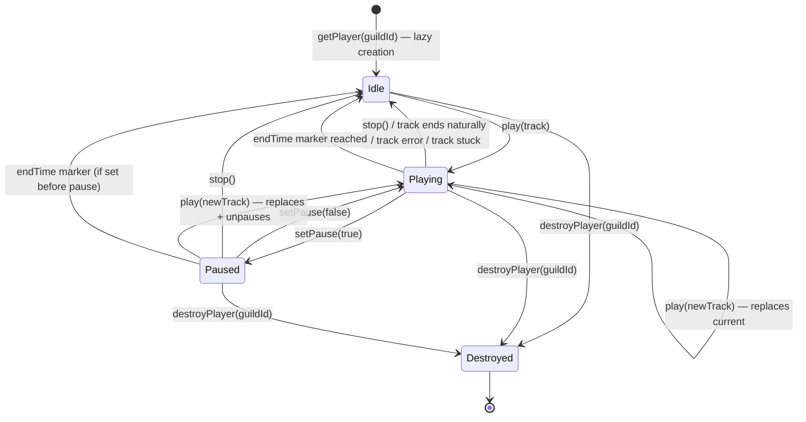
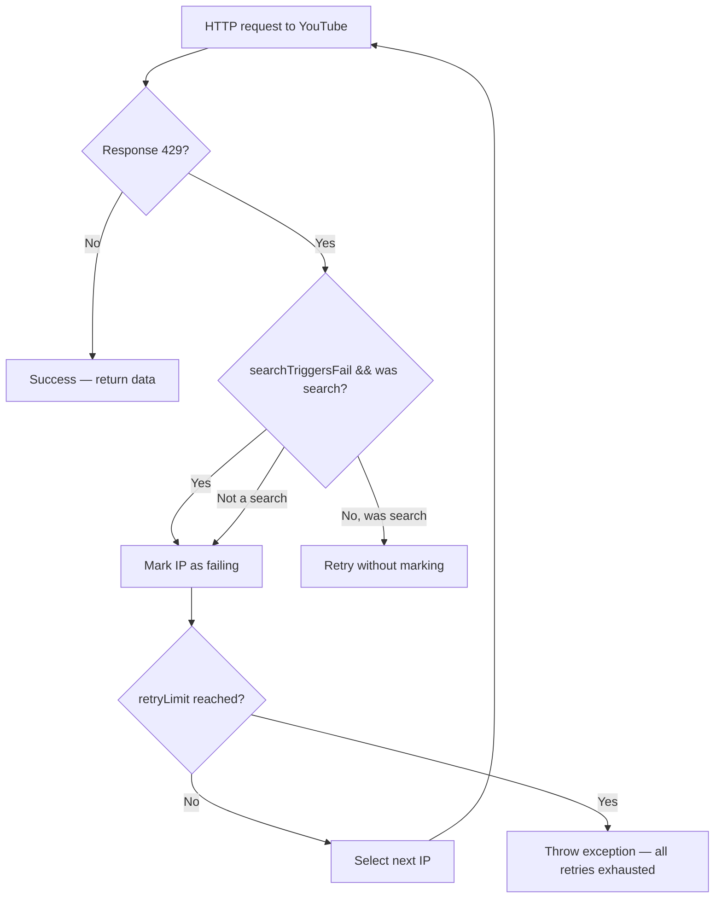
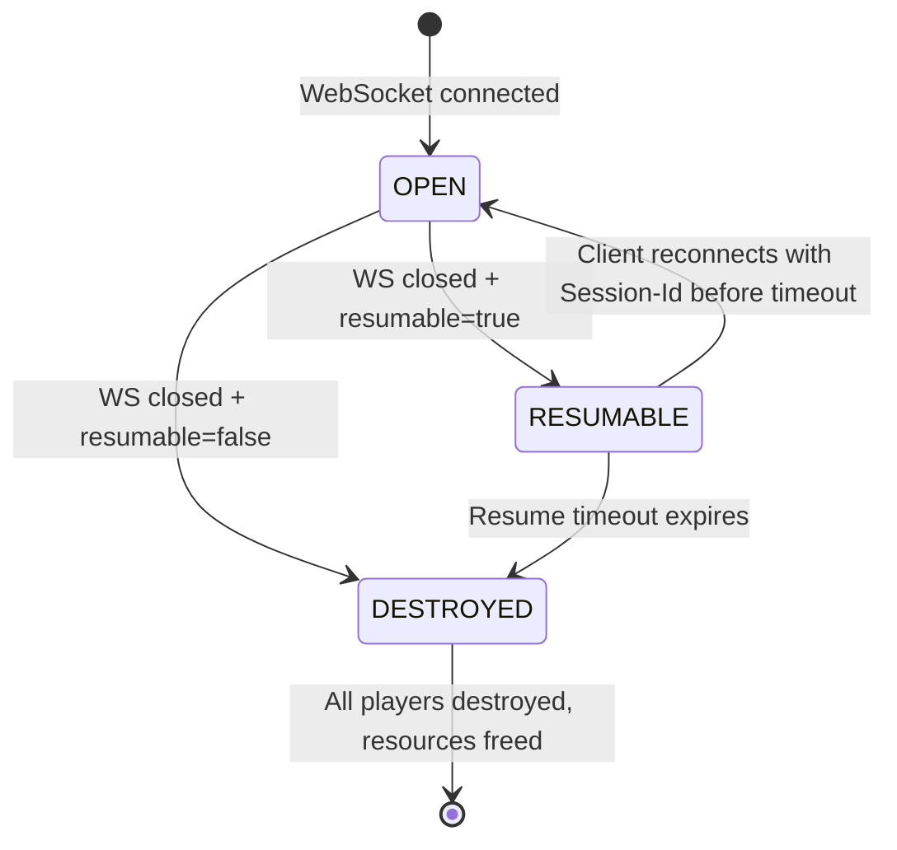
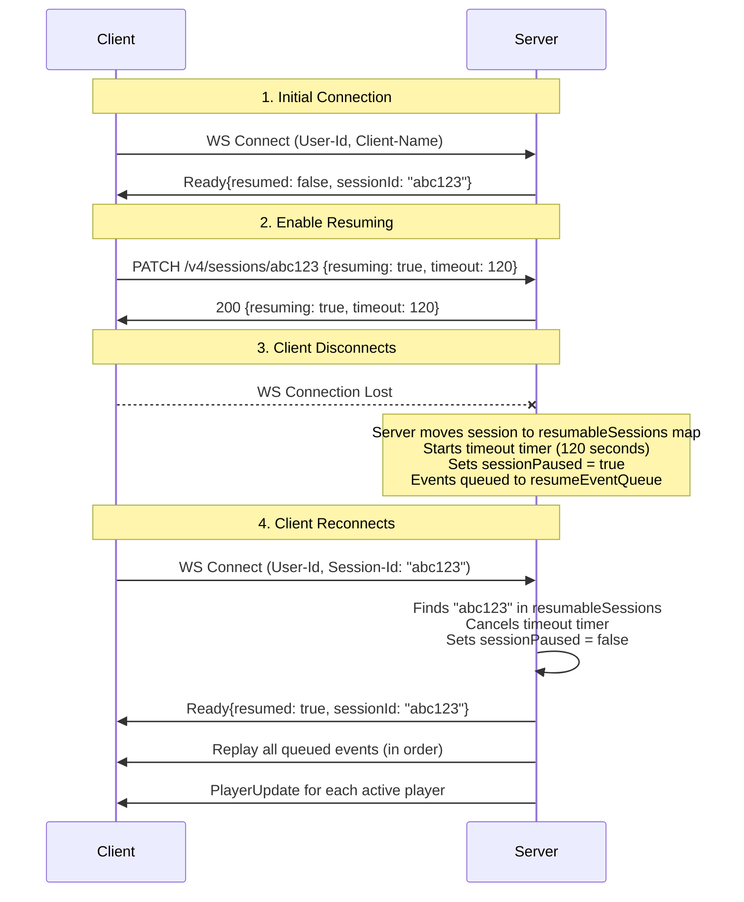

# Lavalink Internals Reference — Rust Implementation Guide

> **Scope**: Player state machine & filters, routeplanner & IP rotation, session resume logic, metrics & stats.
> **Out of scope**: Audio playback, Opus encoding, UDP, Discord voice encryption, plugins.
> **Source of truth**: Lavalink v4 server source code (`LavalinkServer/src/main/java/lavalink/server/`).

---

## Table of Contents

1. [Player State Machine & Filters](#1-player-state-machine--filters)
2. [Routeplanner & IP Rotation](#2-routeplanner--ip-rotation)
3. [Session Resume Logic](#3-session-resume-logic)
4. [Metrics & Stats](#4-metrics--stats)
5. [Undocumented Behavior](#5-undocumented-behavior)
6. [Implementation Checklist](#6-implementation-checklist)

---

## 1. Player State Machine & Filters

### 1.1 Player States

Lavalink does **not** have an explicit state enum. The player's state is derived from the underlying `AudioPlayer` fields. The effective states are:

| Logical State | Condition | `playingTrack` | `isPaused` |
|---|---|---|---|
| **Idle** | No track loaded | `null` | `false` |
| **Playing** | Track loaded, not paused | `Some(track)` | `false` |
| **Paused** | Track loaded, paused | `Some(track)` | `true` |
| **Destroyed** | Player removed from session | N/A (player object dropped) | N/A |

> [!IMPORTANT]
> There is no explicit "stopped" state. Stopping a track (`stopTrack()`) sets `playingTrack = null`, which returns the player to **Idle**. The player object still exists in the session's `ConcurrentHashMap<Long, LavalinkPlayer>`.

### 1.2 State Transition Diagram



### 1.3 State Transition Triggers

| Trigger | Source | Transition | Notes |
|---|---|---|---|
| `PATCH /players/{guildId}` with `track.encoded` or `track.identifier` | REST | Idle/Playing/Paused → Playing | If `noReplace=true` and track already playing, no-op. Pause is reset to `false` unless explicitly set in same request. |
| `PATCH /players/{guildId}` with `encoded: null` | REST | Playing/Paused → Idle | Null encoded track means stop. |
| `PATCH /players/{guildId}` with `paused: true` | REST | Playing → Paused | No-op if already paused. |
| `PATCH /players/{guildId}` with `paused: false` | REST | Paused → Playing | No-op if already playing. |
| Track finishes naturally | Internal (`AudioTrackEndReason::FINISHED`) | Playing → Idle | Emits `TrackEndEvent` with reason `finished`. Client should start next track. |
| Track fails to load/play | Internal (`AudioTrackEndReason::LOAD_FAILED`) | Playing → Idle | Emits `TrackEndEvent` with reason `loadFailed`. Also emits `TrackExceptionEvent` before. |
| `stop()` called | Internal (REST null-track OR `stopTrack()`) | Playing/Paused → Idle | Emits `TrackEndEvent` with reason `stopped`. Client should NOT start next track. |
| New track replaces current | Internal | Playing → Playing | Emits `TrackEndEvent` with reason `replaced` for old track, then `TrackStartEvent` for new. Client should NOT start next track on `replaced`. |
| `DELETE /players/{guildId}` | REST | Any → Destroyed | Removes player from `ConcurrentHashMap`, calls `audioPlayer.destroy()`, destroys Koe connection. |
| `endTime` marker reached | Internal (`TrackEndMarkerHandler`) | Playing → Idle | Sets `endMarkerHit = true`, calls `stop()`. `EventEmitter.onTrackEnd` overrides reason to `FINISHED`. |
| `TrackStuckEvent` | Internal (threshold exceeded) | Stays Playing | Track is NOT automatically stopped. Player keeps playing (or trying to). Client decides what to do. |
| Session cleanup | Internal (session timeout or WS close without resume) | All players → Destroyed | Calls `destroyPlayer()` for every player. |

### 1.4 The `noReplace` Query Parameter

When `PATCH /players/{guildId}?noReplace=true`:
- If `player.track != null` (something is currently loaded): the new track is **silently ignored**, PATCH returns current player state
- If `player.track == null`: the new track plays normally

This is useful for queue systems where you only want to start a track if nothing else is playing.

### 1.5 `endTime` Marker Behavior

Source: `TrackEndMarkerHandler.kt`

```
When endTime is set on a track (via PATCH with endTime field):
1. A TrackMarker is placed at position `endTime` milliseconds
2. When the playback position reaches endTime:
   a. player.endMarkerHit = true
   b. player.stop() is called → triggers onTrackEnd
3. In EventEmitter.onTrackEnd:
   a. If endMarkerHit is true, override the reason to FINISHED (not stopped)
   b. Reset endMarkerHit = false
   c. Emit TrackEndEvent{reason: "finished"}
```

The marker also fires if the position is **bypassed** (e.g., seek past the marker). States: `REACHED` and `BYPASSED` are both handled.

### 1.6 Player Update Interval

Source: `LavalinkPlayer.kt`, `ServerConfig.kt`

- `playerUpdateInterval` is configurable (default: **5 seconds**)
- A `ScheduledFuture` is created on `onTrackStart` that sends `playerUpdate` events at this interval
- The future is **cancelled** on `onTrackEnd`
- If a track starts and the future is already running (not cancelled), it is **reused** — no duplicate schedulers

```rust
// Rust implementation note:
// Use tokio::time::interval(Duration::from_secs(5)) started on track_start,
// cancelled (drop the JoinHandle) on track_end.
```

### 1.7 Audio Filters

#### 1.7.1 Supported Filters

Every filter has an `isEnabled` check. If the filter's parameters match defaults (no-op), it reports disabled:

| Filter | Parameters | Default Values | `isEnabled` When |
|---|---|---|---|
| **Volume** | `volume: f32` | `1.0` | `volume != 1.0` |
| **Equalizer** | `bands: Vec<Band>` (15 bands, gain each) | all `0.0` | any band gain `!= 0.0` |
| **Karaoke** | `level: f32`, `monoLevel: f32`, `filterBand: f32`, `filterWidth: f32` | `1.0, 1.0, 220.0, 100.0` | **always true** (if present) |
| **Timescale** | `speed: f64`, `pitch: f64`, `rate: f64` | `1.0, 1.0, 1.0` | any `!= 1.0` |
| **Tremolo** | `frequency: f32`, `depth: f32` | `2.0, 0.5` | `depth != 0.0` |
| **Vibrato** | `frequency: f32`, `depth: f32` | `2.0, 0.5` | `depth != 0.0` |
| **Distortion** | `sinOffset, sinScale, cosOffset, cosScale, tanOffset, tanScale, offset, scale: f32` | `0,1,0,1,0,1,0,1` | any offset `!= 0.0` or any scale `!= 1.0` |
| **Rotation** | `rotationHz: f64` | `0.0` | `rotationHz != 0.0` |
| **ChannelMix** | `leftToLeft, leftToRight, rightToLeft, rightToRight: f32` | `1,0,0,1` | off-diag `!= 0` or diag `!= 1` |
| **LowPass** | `smoothing: f32` | `20.0` | `smoothing > 1.0` |

#### 1.7.2 Filter Chain Order & Pipeline Architecture

Source: `FilterChain.kt` (`buildList()` and `buildChain()`)

The **build order** (internal list order from `buildList()`) is:

```
1. Volume
2. Equalizer
3. Karaoke
4. Timescale
5. Tremolo
6. Vibrato
7. Distortion
8. Rotation
9. ChannelMix
10. LowPass
11. Plugin filters (dynamic)
```

**Critical**: The pipeline is built in this order, but the audio chain is **reversed** before returning:

```kotlin
// FilterChain.kt line 113
return pipeline.reversed().toMutableList() // Output last
```

The chaining works as follows:
1. Each filter receives the **previous filter** (or the `output` sink) as its output
2. The first filter built writes to `output` (the final PCM output)
3. The last filter built writes to the second-to-last
4. After reversal, audio flows: **Input → LowPass → ChannelMix → Rotation → Distortion → Vibrato → Tremolo → Timescale → Karaoke → Equalizer → Volume → Output**

So the effective **audio signal flow** is:

```
PCM Input
  → LowPass (smooth high frequencies)
  → ChannelMix (L/R mixing matrix)
  → Rotation (8D audio rotation)
  → Distortion (waveshaping via sin/cos/tan)
  → Vibrato (pitch modulation)
  → Tremolo (amplitude modulation)
  → Timescale (speed/pitch/rate)
  → Karaoke (vocal removal)
  → Equalizer (15-band EQ)
  → Volume (gain)
  → PCM Output (to Opus encoder)
```

> [!NOTE]
> Plugin filters come after LowPass conceptually but before all built-in filters in the reversed chain. They are appended to `buildList()` after LowPass.

#### 1.7.3 Filter DSP Details

**Equalizer** — 15 bands (0-14), gain range `-0.25` to `1.0`. Band frequencies (from Lavaplayer):

| Band | Frequency (Hz) |
|---|---|
| 0 | 25 |
| 1 | 40 |
| 2 | 63 |
| 3 | 100 |
| 4 | 160 |
| 5 | 250 |
| 6 | 400 |
| 7 | 630 |
| 8 | 1000 |
| 9 | 1600 |
| 10 | 2500 |
| 11 | 4000 |
| 12 | 6300 |
| 13 | 10000 |
| 14 | 16000 |

**Karaoke** — Subtracts center-panned vocal content. `level` controls effect intensity, `monoLevel` controls mono output level, `filterBand` and `filterWidth` control the frequency target for vocal detection. Uses `KaraokePcmAudioFilter` from lavadsp.

**Timescale** — Uses `TimescalePcmAudioFilter` (libsoundtouch via JNI). `speed` changes playback speed, `pitch` changes pitch independently, `rate` changes both speed and pitch together. All multiply with each other.

**Tremolo** — Amplitude modulation. `frequency` is modulation rate in Hz (must be > 0), `depth` is modulation depth 0.0–1.0.

**Vibrato** — Pitch modulation. `frequency` is vibrato rate in Hz (must be > 0, ≤ 14), `depth` 0.0–1.0.

**Distortion** — Waveshaping function applied per sample: `offset + sample * scale` where scale/offset are applied after `sin(sample * sinScale + sinOffset) + cos(sample * cosScale + cosOffset) + tan(sample * tanScale + tanOffset)`.

**Rotation** — 8D audio effect. `rotationHz` controls the speed of the audio rotation in Hz.

**ChannelMix** — 2×2 mixing matrix. Sample transformation:
```
left_out  = left_in * leftToLeft  + right_in * rightToLeft
right_out = left_in * leftToRight + right_in * rightToRight
```
For mono (both channels equal): `leftToLeft=0.5, leftToRight=0.5, rightToLeft=0.5, rightToRight=0.5`.

**LowPass** — Smoothing factor (higher = more smoothing). Each output sample is weighted average of current input and previous output. `smoothing` of 1.0 = no filtering (direct passthrough), hence `isEnabled` checks `> 1.0`.

#### 1.7.4 How Filter Updates Are Applied

Source: `LavalinkPlayer.kt` (filters setter), `PlayerRestHandler.kt` line 167-170

```kotlin
var filters: FilterChain = FilterChain()
    set(value) {
        audioPlayer.setFilterFactory(value.takeIf { it.isEnabled })
        field = value
    }
```

- Filters are applied via `setFilterFactory()` on the `AudioPlayer`
- **Lavaplayer rebuilds the filter chain on the next audio frame request** — filters take effect on the **current playing track within milliseconds** (next 20ms frame)
- Filters are **NOT** reset between tracks — they persist on the player until explicitly changed
- Filters are stored on the `LavalinkPlayer`, not on the track

#### 1.7.5 Filter Edge Cases

| Scenario | Behavior |
|---|---|
| Set filters on idle (no track) player | Filters are stored. Applied when next track starts. |
| Set filters on paused player | Filters are stored and applied immediately. When unpaused, audio uses new filters. |
| Set filters on destroyed player | 404 — player doesn't exist. |
| Set all filter values to defaults | `isEnabled` returns `false`, `setFilterFactory(null)` is called, removing all filtering. |
| Omit filter fields in PATCH | Omitted filters retain their current values. Only present fields are updated. The entire `FilterChain` is **rebuilt** from the `Filters` payload — omitted filters become `null` (removed). |
| Set karaoke on mono source | Karaoke still runs but has no effect (needs stereo L/R difference). |
| Timescale with speed > 1.0 | Audio plays faster, track duration effectively shorter. Position tracking still uses original timestamps. |

> [!WARNING]
> When filters are sent via PATCH, the **entire** FilterChain is reconstructed from the payload. Filters NOT included in the PATCH are **removed** (become null), not preserved. This is because `FilterChain.parse()` creates a new `FilterChain` from scratch based on the `Filters` object in the request.

#### 1.7.6 Disabled Filters (Server Config)

Filters can be individually disabled in `application.yml`:

```yaml
lavalink:
  server:
    filters:
      volume: true
      equalizer: true
      karaoke: false  # disabled
      # ...
```

If a client sends a PATCH with a disabled filter, the server returns **400 Bad Request**:
```
"Following filters are disabled in the config: karaoke"
```

#### 1.7.7 Rust Implementation Notes — Filters

```rust
/// The filter chain. All fields are Option — None means "not set / use default".
#[derive(Debug, Clone, Default, Serialize, Deserialize)]
#[serde(rename_all = "camelCase")]
pub struct Filters {
    #[serde(skip_serializing_if = "Option::is_none")]
    pub volume: Option<f32>,
    #[serde(skip_serializing_if = "Option::is_none")]
    pub equalizer: Option<Vec<EqBand>>,
    #[serde(skip_serializing_if = "Option::is_none")]
    pub karaoke: Option<KaraokeSettings>,
    #[serde(skip_serializing_if = "Option::is_none")]
    pub timescale: Option<TimescaleSettings>,
    #[serde(skip_serializing_if = "Option::is_none")]
    pub tremolo: Option<TremoloSettings>,
    #[serde(skip_serializing_if = "Option::is_none")]
    pub vibrato: Option<VibratoSettings>,
    #[serde(skip_serializing_if = "Option::is_none")]
    pub distortion: Option<DistortionSettings>,
    #[serde(skip_serializing_if = "Option::is_none")]
    pub rotation: Option<RotationSettings>,
    #[serde(skip_serializing_if = "Option::is_none")]
    pub channel_mix: Option<ChannelMixSettings>,
    #[serde(skip_serializing_if = "Option::is_none")]
    pub low_pass: Option<LowPassSettings>,
}

/// Trait for each filter DSP processor
pub trait AudioFilter: Send + Sync {
    /// Process a buffer of interleaved f32 PCM samples in-place
    fn process(&mut self, samples: &mut [f32], channels: usize, sample_rate: u32);
    fn is_enabled(&self) -> bool;
    fn name(&self) -> &str;
}

// Recommended crates for DSP:
// - `rubato` — high-quality resampling (needed for timescale)
// - `realfft` — FFT for equalizer implementation
// - `dasp` — digital audio signal processing primitives
// - Manual implementation is fine for simpler filters (tremolo, vibrato, volume, channel mix)
```

---

## 2. Routeplanner & IP Rotation

### 2.1 Overview

The routeplanner is a **Lavaplayer extension** (`youtube-rotator`) that rotates IP addresses for outbound HTTP requests to avoid rate limits (primarily from YouTube). Lavalink wraps this with REST endpoints for management.

It is **optional** — if not configured, the routeplanner REST endpoints return `204 No Content` or `500 Internal Server Error`.

### 2.2 Configuration

Source: `application.yml.example` lines 53-58

```yaml
lavalink:
  server:
    ratelimit:
      ipBlocks: ["1.0.0.0/8", "2001:db8::/32"]  # IP blocks to use
      excludedIps: ["1.0.0.1"]                    # IPs to exclude
      strategy: "RotateOnBan"                      # See planner types below
      searchTriggersFail: true                     # 429 on search marks IP as failing
      retryLimit: -1                               # -1=default, 0=infinite, >0=count
```

**Strategy** field maps to planner types:

| Strategy Config Value | Planner Class | Description |
|---|---|---|
| `RotateOnBan` | `RotatingIpRoutePlanner` | Rotates to next IP when current gets rate-limited |
| `LoadBalance` | `BalancingIpRoutePlanner` | Selects IPs using round-robin to distribute load |
| `NanoSwitch` | `NanoIpRoutePlanner` | Rotates through IPs in a /64 block |
| `RotatingNanoSwitch` | `RotatingNanoIpRoutePlanner` | Rotates through /64 blocks, then through IPs within each block |

### 2.3 Planner Types — Internal Logic

#### RotatingIpRoutePlanner (`RotateOnBan`)

- Maintains a **rotating index** into the IP block
- When an IP is banned (429), it marks the IP as failing and advances `rotateIndex`
- `index` = current position in the IP block
- `currentAddress` = the IP currently being used
- Simple sequential rotation through available IPs

#### NanoIpRoutePlanner (`NanoSwitch`)

- Designed for IPv6 /64 blocks (which have 2^64 addresses)
- Uses a **single /64 block** and rotates through addresses within it
- `currentAddress` = current IP being used
- IP selection is essentially random within the massive block

#### RotatingNanoIpRoutePlanner (`RotatingNanoSwitch`)

- Uses **multiple /64 blocks** and rotates between them
- `currentBlock` = index of the current /64 block being used
- `addressIndexInBlock` = current address index within the active block
- When a block runs out of IPs or gets rate-limited, switches to next block

#### BalancingIpRoutePlanner (`LoadBalance`)

- Distributes requests across all IPs using a **load-balancing algorithm**
- No sequential index — picks the "least recently used" or "least loaded" IP
- Only tracks `ipBlock` and `failingAddresses`

### 2.4 Failing Address Tracking

Source: `RoutePlannerRestHandler.kt` line 71-73

```kotlin
val failingAddresses = planner.failingAddresses  // Map<String, Long>
// Key   = IP address string (e.g., "1.0.0.5")
// Value = timestamp (epoch millis) when it was marked as failing
```

- When an IP gets a **429 Too Many Requests** response, it is added to the failing addresses map
- If `searchTriggersFail: true`, search 429s also mark IPs as failing
- Failing IPs are **skipped** during IP selection
- IPs can be manually freed via REST endpoints

### 2.5 REST Endpoints

#### GET `/v4/routeplanner/status`

Returns current routeplanner status.

**Response when routeplanner is configured** (200 OK):

For `RotatingIpRoutePlanner`:
```json
{
  "class": "RotatingIpRoutePlanner",
  "details": {
    "ipBlock": {
      "type": "Inet4Address",
      "size": "16777216"
    },
    "failingAddresses": [
      {
        "failingAddress": "1.0.0.5",
        "failingTimestamp": 1710000000000,
        "failingTime": "Wed Mar 09 2025 12:00:00 GMT"
      }
    ],
    "rotateIndex": "42",
    "ipIndex": "100",
    "currentAddress": "1.0.0.100"
  }
}
```

For `NanoIpRoutePlanner`:
```json
{
  "class": "NanoIpRoutePlanner",
  "details": {
    "ipBlock": {
      "type": "Inet6Address",
      "size": "18446744073709551616"
    },
    "failingAddresses": [],
    "currentAddress": "2001:db8::a1b2"
  }
}
```

For `RotatingNanoIpRoutePlanner`:
```json
{
  "class": "RotatingNanoIpRoutePlanner",
  "details": {
    "ipBlock": {
      "type": "Inet6Address",
      "size": "18446744073709551616"
    },
    "failingAddresses": [],
    "blockIndex": "0",
    "currentAddressIndex": "5000"
  }
}
```

For `BalancingIpRoutePlanner`:
```json
{
  "class": "BalancingIpRoutePlanner",
  "details": {
    "ipBlock": {
      "type": "Inet4Address",
      "size": "256"
    },
    "failingAddresses": []
  }
}
```

**Response when not configured** (204 No Content): empty body.

**IP Block Types**: `"Inet4Address"` or `"Inet6Address"`.

#### POST `/v4/routeplanner/free/address`

Removes a single IP from the failing addresses list.

**Request**:
```json
{ "address": "1.0.0.5" }
```

**Responses**:
- `204 No Content` — success
- `400 Bad Request` — invalid address format
- `500 Internal Server Error` — routeplanner not configured

#### POST `/v4/routeplanner/free/all`

Removes all addresses from the failing list.

**Responses**:
- `204 No Content` — success
- `500 Internal Server Error` — routeplanner not configured

### 2.6 Rate Limit Handling Flow



### 2.7 Edge Cases

| Scenario | Behavior |
|---|---|
| All IPs in block are marked failing | Requests will fail. Manual intervention needed (`POST /free/all`) or wait for internal expiry. |
| Routeplanner not configured (no `ratelimit` in YAML) | `routePlanner` is `null`. GET returns 204. POST endpoints throw 500 with "Can't access disabled route planner". |
| IPv6 block too small (less than /64) | NanoIpRoutePlanner may not work correctly. Designed for /64 blocks. |
| Excluding more IPs than available | Reduces effective pool. Eventually all remaining IPs may be marked failing. |

### 2.8 Rust Implementation Notes — Routeplanner

```rust
use std::collections::HashMap;
use std::net::IpAddr;
use std::time::Instant;

/// Routeplanner trait — implement for each strategy
pub trait RoutePlanner: Send + Sync {
    fn select_address(&mut self) -> Option<IpAddr>;
    fn mark_failing(&mut self, addr: IpAddr);
    fn free_address(&mut self, addr: IpAddr);
    fn free_all_addresses(&mut self);
    fn failing_addresses(&self) -> &HashMap<IpAddr, u64>;
    fn status(&self) -> RoutePlannerStatus;
}

// For Serde deserialization of the polymorphic status response:
#[derive(Debug, Serialize, Deserialize)]
#[serde(tag = "class", content = "details")]
pub enum RoutePlannerStatus {
    RotatingIpRoutePlanner(RotatingDetails),
    NanoIpRoutePlanner(NanoDetails),
    RotatingNanoIpRoutePlanner(RotatingNanoDetails),
    BalancingIpRoutePlanner(BalancingDetails),
}

// Note: In your Rust implementation, the routeplanner is likely optional.
// If you're not proxying YouTube requests yourself, you may not need this at all.
// It's only relevant if your server is making outbound HTTP requests to sources.
```

> [!TIP]
> For a Rust server, routeplanner is only needed if you're fetching audio sources directly (loading tracks from YouTube, SoundCloud, etc.). If you delegate source resolution to an upstream service, you can skip the routeplanner entirely and just implement the REST endpoints as stubs (204/501).

---

## 3. Session Resume Logic

### 3.1 Overview

Session resuming allows a client to disconnect from the WebSocket and reconnect within a timeout window without losing player state. During the disconnection window, events are **queued** and replayed on reconnection.

### 3.2 Session States

Source: `SocketContext.kt` lines 83-88

```kotlin
override val state: ISocketContext.State
    get() = when {
        session.isOpen -> ISocketContext.State.OPEN
        sessionPaused -> ISocketContext.State.RESUMABLE
        else -> ISocketContext.State.DESTROYED
    }
```



### 3.3 Enabling Resume

Resume is configured via REST, **not** via WebSocket:

```
PATCH /v4/sessions/{sessionId}
```

**Request**:
```json
{
  "resuming": true,
  "timeout": 60
}
```

**Response** (200 OK):
```json
{
  "resuming": true,
  "timeout": 60
}
```

| Field | Type | Default | Description |
|---|---|---|---|
| `resuming` | `bool` | `false` | Whether this session can be resumed after disconnect |
| `timeout` | `i64` (seconds) | `60` | How long (seconds) the server holds session state waiting for reconnect |

### 3.4 Full Resume Handshake Flow



### 3.5 What Happens During Disconnection

Source: `SocketContext.kt` (`pause()`, `send()`, `resume()`)

When `sessionPaused = true`:

1. **Events are queued**: All `sendMessage()` calls add the serialized JSON string to `resumeEventQueue` (a `ConcurrentLinkedQueue<String>`) instead of sending over WebSocket
2. **Players keep running**: Audio playback continues, tracks keep playing, tracks can finish naturally
3. **PlayerUpdate events are suppressed**: `SocketServer.sendPlayerUpdate()` returns early when `sessionPaused = true` (line 67)
4. **Timeout is scheduled**: `executor.schedule(onSessionResumeTimeout, resumeTimeout, SECONDS)`

### 3.6 What State Is Preserved vs Lost

| Preserved on Resume | Lost |
|---|---|
| All players and their guild IDs | The WebSocket session itself (new session object) |
| Currently playing tracks (with position) | WebSocket send buffer |
| Player filters | Real-time accuracy of position (clock drift during pause) |
| Player volume | |
| Player paused state | |
| Voice connections (Koe connections) | |
| All queued events | |

### 3.7 Resume Lifecycle in Server Code

Source: `SocketServer.kt`

#### On WebSocket Close (`afterConnectionClosed`):

```kotlin
val context = sessions.remove(sessionId)  // Remove from active sessions
if (context.resumable) {
    // If another resumable session with same ID exists, shut it down
    resumableSessions.remove(context.sessionId)?.shutdown()
    // Move to resumable map
    resumableSessions[context.sessionId] = context
    context.pause()  // Start timeout, set sessionPaused = true
} else {
    context.shutdown()  // Immediately destroy everything
}
```

#### On WebSocket Connect (`afterConnectionEstablished`):

```kotlin
var sessionId = headers["Session-Id"]  // Client provides session to resume
var resumable = if (sessionId != null) resumableSessions.remove(sessionId) else null

if (resumable != null) {
    // Resume path
    sessions[resumable.sessionId] = resumable
    resumable.resume(session)  // Cancel timeout, send Ready{resumed:true}, replay events
} else {
    // New session path
    sessionId = generateUniqueSessionId()
    // Create new SocketContext...
    context.sendMessage(Ready{resumed: false, sessionId})
}
```

#### On Resume Timeout (`onSessionResumeTimeout`):

```kotlin
fun onSessionResumeTimeout(context: SocketContext) {
    resumableSessions.remove(context.sessionId)
    context.shutdown()  // Destroys all players, closes Koe connections
}
```

### 3.8 Event Replay on Resume

Source: `SocketContext.kt` `resume()`, lines 182-194

```kotlin
fun resume(session: WebSocketSession) {
    sessionPaused = false
    this.session = session
    sendMessage(Ready{resumed: true, sessionId})

    // Replay all queued events
    while (resumeEventQueue.isNotEmpty()) {
        send(resumeEventQueue.remove())
    }

    // Send current state for all players
    players.values.forEach { sendPlayerUpdate(this, it) }
}
```

Order on resume:
1. `Ready` event with `resumed: true`
2. All queued events in FIFO order (track starts, track ends, exceptions, etc.)
3. Fresh `PlayerUpdate` for every player (current position, connected status)

### 3.9 Edge Cases

| Scenario | Behavior |
|---|---|
| Client reconnects **after** timeout | Session was destroyed. New session created. All players gone. `Ready{resumed: false}` with **new** sessionId. |
| Client sends **wrong** Session-Id | Not found in `resumableSessions`. New session created. `Ready{resumed: false}` with new sessionId. |
| Client sends Session-Id that was **never resumable** | Same as wrong ID — new session. |
| Client reconnects **without** Session-Id header | Always creates new session. Cannot resume. |
| Multiple clients try to resume same session | First one wins — session is `remove()`d from `resumableSessions`. Second client gets new session. |
| Resume while track is in middle of playing | Track continues playing. Client gets all queued events + current PlayerUpdate with accurate position. |
| Server crash/restart | All session state is in-memory only. No persistence. All sessions are lost. |
| Resume enabled but `timeout: 0` | Timeout fires immediately (or near-immediately). Session is destroyed before client can reconnect. |
| Duplicate resumable session IDs | Old resumable session with same ID is shut down, new one replaces it. (See `afterConnectionClosed` code.) |

### 3.10 Rust Implementation Notes — Session Resume

```rust
use std::collections::{HashMap, VecDeque};
use tokio::time::{sleep, Duration};
use tokio::sync::mpsc;

pub struct Session {
    pub id: String,
    pub resumable: bool,
    pub resume_timeout: u64,  // seconds
    pub players: HashMap<u64, Player>,  // guild_id -> Player

    // Resume state
    state: SessionState,
    event_queue: VecDeque<String>,  // Queued JSON messages during pause
    resume_timeout_handle: Option<tokio::task::JoinHandle<()>>,
}

#[derive(Debug, Clone, PartialEq)]
pub enum SessionState {
    Open,
    Resumable,  // WS closed, waiting for resume
    Destroyed,
}

impl Session {
    pub fn pause(&mut self) {
        self.state = SessionState::Resumable;
        // Start timeout task that calls destroy() after self.resume_timeout
    }

    pub fn resume(&mut self, new_ws: /* websocket sender */) {
        self.state = SessionState::Open;
        // Cancel timeout
        if let Some(handle) = self.resume_timeout_handle.take() {
            handle.abort();
        }
        // Send Ready{resumed: true, sessionId}
        // Drain event_queue and send all
        while let Some(event) = self.event_queue.pop_front() {
            // send event over new_ws
        }
        // Send PlayerUpdate for every player
    }

    pub fn send_event(&mut self, event_json: String) {
        match self.state {
            SessionState::Open => { /* send over websocket */ }
            SessionState::Resumable => { self.event_queue.push_back(event_json); }
            SessionState::Destroyed => { /* discard */ }
        }
    }
}
```

---

## 4. Metrics & Stats

### 4.1 Stats WebSocket Event

Source: `StatsCollector.kt`, `SocketContext.kt` init block (line 99-100)

Stats are pushed over WebSocket to each connected client as an OP:

```json
{
  "op": "stats",
  "players": 5,
  "playingPlayers": 2,
  "uptime": 86400000,
  "memory": {
    "free": 100000000,
    "used": 150000000,
    "allocated": 250000000,
    "reservable": 500000000
  },
  "cpu": {
    "cores": 4,
    "systemLoad": 0.25,
    "lavalinkLoad": 0.05
  },
  "frameStats": {
    "sent": 3000,
    "nulled": 5,
    "deficit": -5
  }
}
```

#### Push Frequency

- Stats are pushed **every 60 seconds** (1 minute interval)
- Scheduled via `executor.scheduleAtFixedRate(task, 0, 1, TimeUnit.MINUTES)` in `SocketContext.init`
- Initial push happens immediately (delay = 0)
- There is **no mechanism for early/triggered pushes** — stats are strictly periodic

#### Field Definitions

| Field | Type | Description |
|---|---|---|
| `players` | `int` | Total number of players across ALL sessions (not just this one) |
| `playingPlayers` | `int` | Number of players with `isPlaying == true` (track loaded AND not paused) across ALL sessions |
| `uptime` | `i64` (ms) | Milliseconds since server start (`System.currentTimeMillis() - Launcher.startTime`) |
| `memory.free` | `i64` (bytes) | JVM `Runtime.freeMemory()` — free memory in current heap |
| `memory.used` | `i64` (bytes) | `totalMemory() - freeMemory()` — used heap memory |
| `memory.allocated` | `i64` (bytes) | `Runtime.totalMemory()` — current heap size |
| `memory.reservable` | `i64` (bytes) | `Runtime.maxMemory()` — maximum heap the JVM will attempt to use |
| `cpu.cores` | `int` | Logical processor count |
| `cpu.systemLoad` | `f64` | System-wide CPU load (0.0 to 1.0) |
| `cpu.lavalinkLoad` | `f64` | Lavalink process CPU load normalized across all cores (0.0 to 1.0) |
| `frameStats` | `object \| null` | Per-session audio frame statistics. **Only present in WebSocket stats event** (has session context). Null from REST. |
| `frameStats.sent` | `int` | Average frames successfully sent per player (last minute) |
| `frameStats.nulled` | `int` | Average null (silent) frames per player (last minute) |
| `frameStats.deficit` | `int` | Average frame deficit per player (expected − sent − nulled) |

### 4.2 Stats REST Endpoint

```
GET /v4/stats
```

Returns the same stats structure but **without `frameStats`** (it's always `null` because there's no session context for the REST handler).

**Response** (200 OK):
```json
{
  "players": 5,
  "playingPlayers": 2,
  "uptime": 86400000,
  "memory": {
    "free": 100000000,
    "used": 150000000,
    "allocated": 250000000,
    "reservable": 500000000
  },
  "cpu": {
    "cores": 4,
    "systemLoad": 0.25,
    "lavalinkLoad": 0.05
  },
  "frameStats": null
}
```

### 4.3 CPU Calculation Details

Source: `StatsCollector.kt` (`performCpuStatsCalculation()`)

**System Load**:
- Uses `oshi` library's `SystemInfo` → `HardwareAbstractionLayer` → `CentralProcessor`
- Calculated via `getSystemCpuLoadBetweenTicks(prevTicks)` — delta-based between two measurements
- First measurement always returns `0.0` (no baseline)
- CPU stats are **cached for 30 seconds** (`CPU_STATS_REFRESH_INTERVAL_MS = 30000`)
- Thread-safe with synchronized blocks and double-checked locking

**Lavalink Process Load**:
- Gets current process via `os.getProcess(os.processId)`
- Calculates: `(cpuTimeDiff / uptimeDiff) / logicalProcessorCount`
- Where `cpuTimeDiff = (kernelTime + userTime)_now - (kernelTime + userTime)_prev`
- First measurement returns `0.0` (no baseline)
- Values clamped to `[0.0, 1.0]` and NaN/Infinity → `0.0`

### 4.4 Frame Stats (AudioLossCounter)

Source: `AudioLossCounter.kt`

Each player has its own `AudioLossCounter`. It tracks:
- **Success**: Frame was provided by audio player (Opus data available)
- **Loss** (nulled): Frame was requested but audio player returned nothing (no audio available)

**Expected frames per minute**: `60 * 1000 / 20 = 3000` (20ms Opus frame interval)

**Data usability check** (`isDataUsable`):
- Must have been playing for at least 1 full minute
- No gap > 100ms between track end and track start (acceptable switch time)
- If data is not usable for a player, that player is excluded from frameStats average

**Deficit calculation**:
```
deficit = playerCount * EXPECTED_PACKET_COUNT_PER_MIN - (totalSent + totalNulled)
```

A negative deficit can occur if extra frames were somehow counted (rare). Positive deficit means expected frames went completely unaccounted for.

**Averaging**: frameStats values are divided by `playerCount` (only players with usable data counted).

### 4.5 Info Endpoint

```
GET /v4/info
```

**Response** (200 OK):
```json
{
  "version": {
    "semver": "4.0.0",
    "major": 4,
    "minor": 0,
    "patch": 0,
    "preRelease": null,
    "build": null
  },
  "buildTime": 1710000000000,
  "git": {
    "branch": "main",
    "commit": "abc1234",
    "commitTime": 1710000000000
  },
  "jvm": "21.0.1",
  "lavaplayer": "2.0.0",
  "sourceManagers": ["youtube", "soundcloud", "bandcamp", "twitch", "vimeo", "http"],
  "filters": ["volume", "equalizer", "karaoke", "timescale", "tremolo", "vibrato", "distortion", "rotation", "channelMix", "lowPass"],
  "plugins": [
    {
      "name": "some-plugin",
      "version": "1.0.0"
    }
  ]
}
```

| Field | Description |
|---|---|
| `version` | Server version broken into semver components |
| `buildTime` | Epoch millis when the server was built |
| `git` | Git metadata from build |
| `jvm` | JVM version (Rust equivalent: your server version) |
| `lavaplayer` | Audio library version |
| `sourceManagers` | List of enabled audio source names |
| `filters` | List of enabled filter names |
| `plugins` | List of loaded plugins |

### 4.6 Version Endpoint

```
GET /v4/version
```

Returns plain text version string: `4.0.0`

Content-Type: `text/plain`

### 4.7 Prometheus Metrics

Source: `LavalinkStatsCollector.kt`, config at `application.yml.example` line 72-75

**Configuration**:
```yaml
metrics:
  prometheus:
    enabled: false    # Set to true to enable
    endpoint: /metrics
```

**Exposed Metrics** (all are Gauge type with `lavalink_` prefix):

| Metric Name | Help | Source |
|---|---|---|
| `lavalink_players_total` | Total number of players connected | `stats.players` |
| `lavalink_playing_players_total` | Number of players currently playing audio | `stats.playingPlayers` |
| `lavalink_uptime_milliseconds` | Uptime of the node in milliseconds | `stats.uptime` |
| `lavalink_memory_free_bytes` | Memory statistics in bytes (Free) | `stats.memory.free` |
| `lavalink_memory_used_bytes` | Memory statistics in bytes (Used) | `stats.memory.used` |
| `lavalink_memory_allocated_bytes` | Memory statistics in bytes (Allocated) | `stats.memory.allocated` |
| `lavalink_memory_reservable_bytes` | Memory statistics in bytes (Reservable) | `stats.memory.reservable` |
| `lavalink_cpu_cores` | CPU statistics (Cores) | `stats.cpu.cores` |
| `lavalink_cpu_system_load_percentage` | CPU statistics (System Load) | `stats.cpu.systemLoad` |
| `lavalink_cpu_lavalink_load_percentage` | CPU statistics (LL Load) | `stats.cpu.lavalinkLoad` |

**Notes**:
- `frameStats` is NOT exposed via Prometheus (requires session context, Prometheus scrapes have none)
- The collector is only instantiated if `metrics.prometheus.enabled = true` in config
- Uses `io.prometheus.client.Collector` — standard Prometheus Java client
- All metrics are recalculated on each scrape (calls `retrieveStats(null)`)

### 4.8 Rust Implementation Notes — Metrics & Stats

```rust
use std::time::Instant;

pub struct StatsCollector {
    start_time: Instant,
    cpu_stats_cache: Option<CpuStats>,
    last_cpu_calc: Instant,
}

pub struct Stats {
    pub players: i32,
    pub playing_players: i32,
    pub uptime: u64,        // milliseconds
    pub memory: MemoryStats,
    pub cpu: CpuStats,
    pub frame_stats: Option<FrameStats>,
}

#[derive(Debug, Clone, Serialize, Deserialize)]
pub struct MemoryStats {
    pub free: u64,
    pub used: u64,
    pub allocated: u64,
    pub reservable: u64,
}

#[derive(Debug, Clone, Serialize, Deserialize)]
#[serde(rename_all = "camelCase")]
pub struct CpuStats {
    pub cores: i32,
    pub system_load: f64,
    pub lavalink_load: f64,
}

#[derive(Debug, Clone, Serialize, Deserialize)]
pub struct FrameStats {
    pub sent: i32,
    pub nulled: i32,
    pub deficit: i32,
}
```

**Recommended Rust crates**:

| Crate | Purpose |
|---|---|
| `sysinfo` | Cross-platform system/process CPU and memory info (Rust equivalent of oshi) |
| `metrics` | High-performance metrics facade (gauges, counters, histograms) |
| `metrics-exporter-prometheus` | Prometheus exporter for the `metrics` crate |
| `procfs` | Linux-specific `/proc` reading (alternative for detailed process stats) |

**Memory stats mapping for Rust**:
- **Lavalink (JVM)**: `free`, `used`, `allocated` (current heap), `reservable` (max heap)
- **Rust equivalent**: Use `sysinfo::System` for process memory. Since Rust has no heap size concept like JVM:
  - `allocated` → process RSS (resident set size)
  - `used` → same as allocated (no separate concept of "committed but unused" heap)
  - `free` → system free memory (or set to 0)
  - `reservable` → system total memory (or process virtual size)

**CPU load via `sysinfo`**:
```rust
use sysinfo::{System, Pid};

let mut sys = System::new();
sys.refresh_cpu_all();
// Wait, then refresh again for delta
let cpu_load = sys.global_cpu_usage() / 100.0;  // 0.0 to 1.0

// Process CPU
let pid = Pid::from(std::process::id() as usize);
sys.refresh_processes(sysinfo::ProcessesToUpdate::Some(&[pid]), true);
if let Some(process) = sys.process(pid) {
    let lavalink_load = process.cpu_usage() / 100.0 / sys.cpus().len() as f32;
}
```

**Stats push interval**: Use `tokio::time::interval(Duration::from_secs(60))` per session to push stats.

**AudioLossCounter in Rust**:
```rust
pub struct AudioLossCounter {
    playing_since: Option<Instant>,
    last_track_started: Option<Instant>,
    last_track_ended: Option<Instant>,

    current_minute: u64,  // minute index
    current_loss: u32,
    current_success: u32,

    pub last_minute_loss: u32,
    pub last_minute_success: u32,
}

impl AudioLossCounter {
    const EXPECTED_PACKETS_PER_MIN: u32 = 3000; // 60s / 20ms
    const ACCEPTABLE_TRACK_SWITCH_MS: u64 = 100;

    pub fn on_success(&mut self) { self.check_time(); self.current_success += 1; }
    pub fn on_loss(&mut self) { self.check_time(); self.current_loss += 1; }

    pub fn is_data_usable(&self) -> bool {
        // Must have been playing for > 1 minute
        // Gap between tracks must be < 100ms
    }

    fn check_time(&mut self) {
        let now_minute = SystemTime::now()
            .duration_since(UNIX_EPOCH).unwrap().as_secs() / 60;
        if self.current_minute != now_minute {
            self.last_minute_loss = self.current_loss;
            self.last_minute_success = self.current_success;
            self.current_loss = 0;
            self.current_success = 0;
            self.current_minute = now_minute;
        }
    }
}
```

---

## 5. Undocumented Behavior

These behaviors are **inferred from source code** and not mentioned in official documentation:

### 5.1 Player Creation is Lazy

Players are created on first access via `getPlayer(guildId)` which uses `computeIfAbsent`. There is no explicit "create player" endpoint. A `PATCH /players/{guildId}` that references a non-existent player will create it.

### 5.2 Filter PATCH Replaces Entire Chain

The official docs say "update filters" but in reality, `FilterChain.parse()` builds a **brand new** chain from the request. Any filter not included in the PATCH body is effectively removed. There is no merge behavior.

### 5.3 Stats Count All Sessions

`players` and `playingPlayers` in stats are summed across **all** connected WebSocket sessions, not just the requesting session. This means a multi-bot deployment will see aggregate counts.

### 5.4 PlayerUpdate Suppressed During Resume

`SocketServer.sendPlayerUpdate()` returns immediately (no-op) if `sessionPaused = true`. This means no position updates are queued — position data is only refreshed when the client reconnects (via the `resume()` method's final `sendPlayerUpdate` loop).

### 5.5 endMarkerHit Race Condition Potential

The `endMarkerHit` flag is a non-volatile `var Boolean` on `LavalinkPlayer`. It's set by the `TrackEndMarkerHandler` and read by `EventEmitter.onTrackEnd`. Both run on Lavaplayer's internal threads. In Lavalink this works because operations happen sequentially on the same audio thread, but in a Rust implementation you should use `AtomicBool`.

### 5.6 Session ID Generation

Session IDs are 16-character random strings from `[a-z0-9]`. Generated with `List(16) { charPool.random() }.joinToString("")`. Uniqueness is guaranteed by retry loop checking `sessions` map.

### 5.7 CPU Stats Have 30-Second Staleness

CPU metrics (both system and process load) are cached for 30 seconds. Multiple stats pushes or REST calls within that window return identical CPU values.

### 5.8 No WebSocket Ping/Pong Handling

Lavalink v4's `SocketServer` extends `TextWebSocketHandler` and only overrides `afterConnectionEstablished`, `afterConnectionClosed`, and `handleTextMessage` (which just logs a warning). There is **no explicit ping/pong** handling — it relies on the underlying WebSocket library (Undertow) defaults.

### 5.9 WebSocket Text Messages Are Rejected

```kotlin
override fun handleTextMessage(session: WebSocketSession, message: TextMessage) {
    log.warn("Lavalink v4 does not support websocket messages. Please use the REST api.")
}
```

All client→server communication in v4 is via REST. The WebSocket is **server→client only** (events).

### 5.10 Voice Connection Reuse

The `PATCH /players/{guildId}` voice state handling only creates a new connection if the endpoint, token, or sessionId changed, or if the gateway connection is closed. Otherwise, it reuses the existing connection. (`PlayerRestHandler.kt` lines 114-131)

### 5.11 Paused Player During New Track

When a track is loaded via PATCH with both a track and `paused: true`, the `paused` field is applied **first** (before `play()`), ensuring the track starts paused. If `paused` is omitted when loading a new track, it defaults to `false` (unpaused).

### 5.12 userData on Track vs Player Scope

`userData` is set on the `AudioTrack` object, not the `LavalinkPlayer`. When a new track is loaded, the userData from the PATCH request is applied to the new track. When updating userData without loading a new track (no encoded/identifier), it's set on the currently playing track via `player.track?.userData = it`.

---

## 6. Implementation Checklist

### Player State Machine
- [ ] Player struct with fields: `guild_id`, `audio_player`, `filters`, `volume`, `track`, `paused`
- [ ] Lazy player creation (`get_or_create_player(guild_id)`)
- [ ] State derivation: idle (no track), playing, paused, destroyed
- [ ] `play(track)` — load track, start playback, send PlayerUpdate
- [ ] `stop()` — stop current track, emit TrackEndEvent{stopped}
- [ ] `set_pause(bool)` — toggle pause
- [ ] `seek_to(position)` — seek on current track
- [ ] `set_volume(volume)` — change volume on audio player
- [ ] `destroy()` — remove player, close voice connection
- [ ] `noReplace` logic — skip play if track already loaded
- [ ] `endTime` marker — stop track at specific position, emit finished (not stopped)
- [ ] Player update interval (configurable, default 5s) — scheduled push of position/connected/ping
- [ ] Cancel update interval on track end
- [ ] Handle concurrent track replace (old track emits `replaced` reason)

### Filters
- [ ] `FilterChain` struct holding all 10 filter configs as `Option<T>`
- [ ] `is_enabled()` — any filter active
- [ ] Filter pipeline build with correct order: LowPass→ChannelMix→Rotation→Distortion→Vibrato→Tremolo→Timescale→Karaoke→Equalizer→Volume (audio signal flow)
- [ ] Volume filter (gain multiply, disabled at 1.0)
- [ ] Equalizer filter (15-band, gains -0.25 to 1.0)
- [ ] Karaoke filter (vocal removal, always enabled when present)
- [ ] Timescale filter (speed/pitch/rate via SoundTouch or rubato)
- [ ] Tremolo filter (amplitude modulation)
- [ ] Vibrato filter (pitch modulation)
- [ ] Distortion filter (sin/cos/tan waveshaping)
- [ ] Rotation filter (8D audio, rotationHz)
- [ ] ChannelMix filter (2×2 L/R matrix)
- [ ] LowPass filter (smoothing > 1.0 to enable)
- [ ] Filters apply to current track immediately (next frame)
- [ ] Filters persist across tracks (stored on player, not track)
- [ ] PATCH replaces entire filter chain (no merge)
- [ ] Filter disable config (server-level, reject disabled filters with 400)
- [ ] Filter serialization in player state response

### Routeplanner
- [ ] `RoutePlanner` trait with `select_address`, `mark_failing`, `free_address`, `free_all`
- [ ] `RotatingIpRoutePlanner` (sequential rotation on ban)
- [ ] `NanoIpRoutePlanner` (IPv6 /64 block rotation)
- [ ] `RotatingNanoIpRoutePlanner` (rotating /64 blocks)
- [ ] `BalancingIpRoutePlanner` (load-balanced selection)
- [ ] Failing address map: `HashMap<IpAddr, u64>` (timestamp)
- [ ] `GET /v4/routeplanner/status` — polymorphic response based on planner type
- [ ] `POST /v4/routeplanner/free/address` — unmark single IP
- [ ] `POST /v4/routeplanner/free/all` — unmark all IPs
- [ ] Handle "not configured" case (204 for status, 500 for free endpoints)
- [ ] IP block config parsing (CIDR blocks, excluded IPs)
- [ ] `searchTriggersFail` config
- [ ] `retryLimit` config (-1/0/>0)

### Session Resume
- [ ] Session state enum: `Open`, `Resumable`, `Destroyed`
- [ ] `resumable: bool` flag per session (default false)
- [ ] `resume_timeout: u64` config per session (default 60s)
- [ ] `PATCH /v4/sessions/{sessionId}` — update resume config
- [ ] On WS close + resumable: move to resumable map, start timeout, set paused
- [ ] On WS close + not resumable: destroy immediately
- [ ] Event queue (`VecDeque<String>`) for events during pause
- [ ] Events queued during pause instead of sent
- [ ] PlayerUpdate suppressed during pause
- [ ] On resume: cancel timeout, send Ready{resumed:true}, replay queue, send PlayerUpdates
- [ ] On timeout expiry: destroy session and all players
- [ ] Session-Id header to identify resume session
- [ ] Handle duplicate session IDs (shutdown old, keep new)
- [ ] Handle wrong/expired session IDs (create new session)

### Metrics & Stats
- [ ] `StatsCollector` that calculates all stats fields
- [ ] Player count (total and playing) summed across all sessions
- [ ] Uptime calculation (millis since server start)
- [ ] Memory stats (free, used, allocated, reservable)
- [ ] CPU stats (cores, system load, process load) with caching (30s)
- [ ] Frame stats (sent, nulled, deficit) per-session from AudioLossCounter
- [ ] `AudioLossCounter` per player — track success/loss per minute
- [ ] `is_data_usable()` check (playing > 1 min, no gaps > 100ms)
- [ ] Expected packet count: 3000 per minute (20ms frames)
- [ ] Stats WebSocket push every 60 seconds per session
- [ ] `GET /v4/stats` REST endpoint (no frameStats)
- [ ] `GET /v4/info` REST endpoint (version, sources, filters, plugins)
- [ ] `GET /v4/version` endpoint (plain text)
- [ ] Prometheus metrics endpoint (`/metrics`) — 10 gauges with `lavalink_` prefix
- [ ] Prometheus conditional enablement (config flag)
- [ ] Use `metrics` + `metrics-exporter-prometheus` crates
