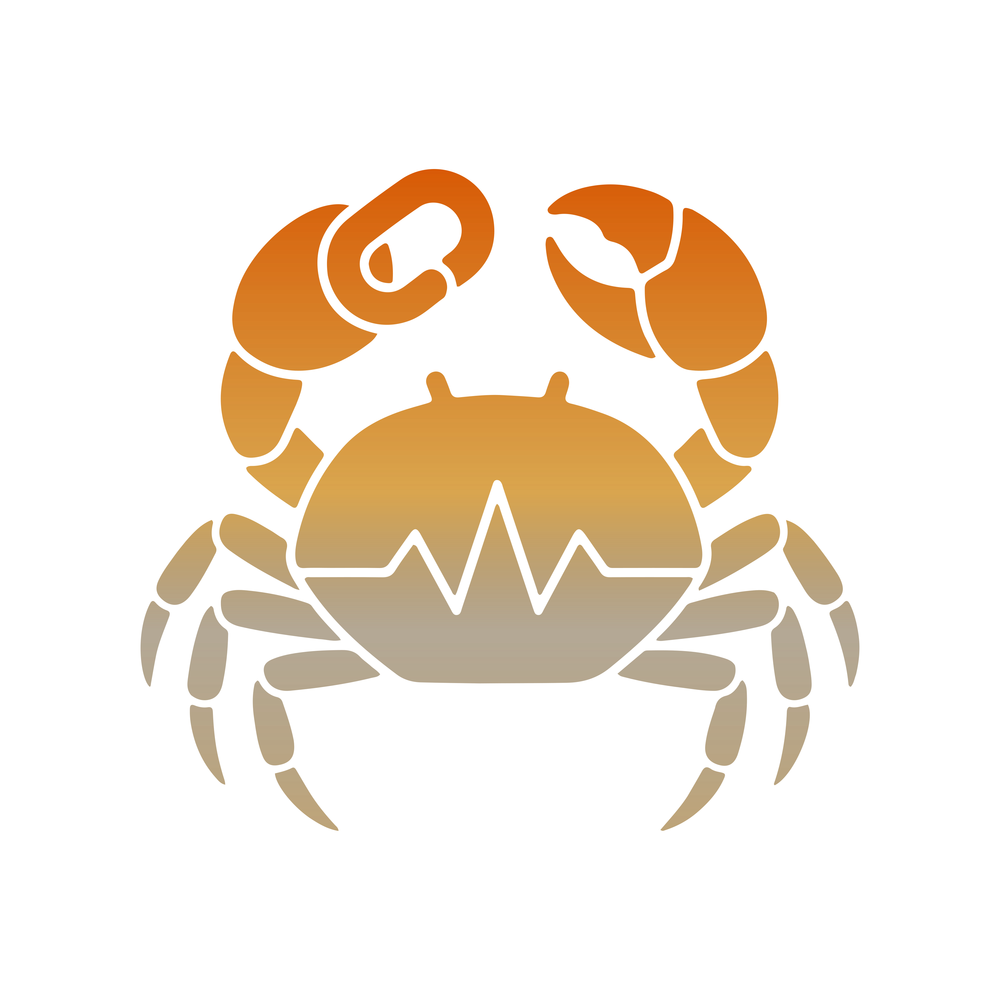

<p align="center">
  
</p>

<p align="center">
  
  
  
  
</p>

# Rustalink

A high-performance Discord audio sending server written in Rust.

### Key Features

#### 📼 Tape Stop
Adds a gradual slowdown/speed-up effect when pausing and resuming playback.

```toml
# Adds a gradual slowdown/speed-up effect (tape stop) when pausing and resuming.
tape_stop = true
# Duration of the slowdown/speed-up transition in milliseconds.
tape_stop_duration_ms = 600
```

---

## Supported Sources

Rustalink supports direct playback and **Mirroring**. Mirroring allows playback from metadata-only services (like Spotify) by automatically finding the best audio match from your configured mirror providers.

### Source Table

| Source | Type | Search Prefix | Features |
| :--- | :---: | :--- | :--- |
| **YouTube** | Direct | `ytsearch:`, `ytmsearch:` | `ytrec:`, Lyrics |
| **SoundCloud** | Direct | `scsearch:` | - |
| **Spotify** | Mirror | `spsearch:` | `sprec:` |
| **Apple Music**| Mirror | `amsearch:` | - |
| **Deezer** | Hybrid | `dzsearch:`, `dzisrc:` | `dzrec:`, Lyrics |
| **Tidal** | Mirror | `tdsearch:` | `tdrec:` |
| **Qobuz** | Hybrid | `qbsearch:`, `qbisrc:` | `qbrec:` |
| **Bandcamp** | Direct | `bcsearch:` | - |
| **MixCloud** | Direct | `mcsearch:` | - |
| **JioSaavn** | Hybrid | `jssearch:` | `jsrec:` |
| **Gaana** | Hybrid | `gnsearch:` | - |
| **Yandex Music**| Hybrid | `ymsearch:` | `ymrec:`, Lyrics |
| **Audiomack** | Hybrid | `amksearch:` | - |
| **Anghami** | Mirror | `agsearch:` | - |
| **Shazam** | Mirror | `shsearch:` | - |
| **Pandora** | Mirror | `pdsearch:` | `pdrec:` |
| **Audius** | Direct | `ausearch:`, `audsearch:` | - |
| **HTTP / Local**| Direct | - | - |

> [!NOTE]
> **Hybrid** sources support direct playback if credentials/tokens are provided or if a direct playback URL is received. Otherwise, they fall back to mirroring.

### YouTube Playback Clients

To optimize playback and bypass restrictions, Rustalink supports switching between multiple YouTube client implementations. You can configure these in `config.toml`.

| Client Alias  | Search | Resolve | Playback |
| :--- | :--- | :---: | :---: |
| `WEB` | ✅ | ✅ | ✅ |
| `MWEB` / `REMIX` | ✅ | ✅ | ✅ |
| `ANDROID` | ✅ | ✅ | ✅ |
| `IOS` | ✅ | ✅ | ✅ |
| `TV` / `TVHTML5` | ✅ | ✅ | ✅ |
| `TV_CAST` | ✅ | ✅ | ✅ |
| `TV_EMBEDDED` | ✅ | ✅ | ✅ |
| `MUSIC_ANDROID` | ✅ | ✅ | ✅ |
| `ANDROID_VR` | ✅ | ❌ | ✅ |
| `WEB_EMBEDDED` | ✅ | ❌ | ✅ |
| `WEB_PARENT_TOOLS` | ✅ | ✅ | ❌ |

---

## 🛠️ Installation

### Running with Docker (Recommended)
Docker ensures a consistent environment with all dependencies pre-configured.

#### 1. Pull the latest image
```bash
docker pull ghcr.io/bong-project/rustalink:latest
```

#### 2. Setup configuration
Create a directory for your configuration and logs:
```bash
mkdir rustalink
cp config.default.toml rustalink/config.toml
```
Edit `rustalink/config.toml` to your liking.

#### 3. Run the container
```bash
docker run -d \
  --name rustalink \
  -p 2333:2333 \
  -v $(pwd)/rustalink/config.toml:/app/config.toml \
  -v $(pwd)/rustalink/logs:/app/logs \
  --restart unless-stopped \
  ghcr.io/bong-project/rustalink:latest
```

#### 4. Docker Compose (Alternative)
Create a `docker-compose.yml`:
```yaml
services:
  rustalink:
    image: ghcr.io/bong-project/rustalink:latest
    ports:
      - "2333:2333"
    volumes:
      - ./config.toml:/app/config.toml
      - ./logs:/app/logs
    restart: unless-stopped
```
Run with: `docker compose up -d`

---

### Running Native
Download the appropriate binary for your system from the [Releases](https://github.com/bong-project/rustalink/releases) page or build from source.

#### 🪟 Windows
1. Download `rustalink-x86_64-pc-windows-msvc.exe`.
2. Install the [Visual C++ Redistributable](https://aka.ms/vs/17/release/vc_redist.x64.exe).
3. Place `config.toml` next to the `.exe`.
4. Run via Command Prompt or PowerShell: `.\rustalink.exe`

#### 🏔️ Linux (Arch / Ubuntu)
1. Download `rustalink-x86_64-unknown-linux-musl`.
2. Install build dependencies if needed:
   - **Arch**: `sudo pacman -S cmake gcc pkg-config`
   - **Ubuntu**: `sudo apt install cmake build-essential pkg-config`
3. Make executable: `chmod +x rustalink-x86_64-unknown-linux-musl`
4. Run: `./rustalink-x86_64-unknown-linux-musl`

#### 🍎 macOS
1. Download the correct binary (Intel/M1/M2/M3).
2. Remove quarantine if blocked: `xattr -d com.apple.quarantine rustalink-*-apple-darwin`
3. Make executable and run: `chmod +x rustalink-*-apple-darwin && ./rustalink-*-apple-darwin`

---

## ⚙️ Configuration

Rustalink uses a `config.toml` file for its settings.
- **Port**: Default is `2333`.
- **Password**: Default is `youshallnotpass`.
- **Sources**: Enable or disable providers (YouTube, Spotify, etc.) in the `[sources]` section.
- **Logging**: Configure verbosity in the `[logging]` section.
- **Mirroring**: Configure mirror priority and concurrent fetching.

---

## 🛠️ Building from Source

### 🛠️ Build Requirements
- **Rust**: Latest stable.
- **C-Toolchain**: `gcc`, `g++`, `make`, `cmake`, `pkg-config`.
- **Clang/LLVM**: Required for `bindgen`.

#### Install Commands:
- **Ubuntu/Debian**: `sudo apt install cmake pkg-config libclang-dev clang gcc g++ make perl`
- **Arch Linux**: `sudo pacman -S cmake pkgconf clang gcc make perl`

### Commands
```bash
# Clone the repository
git clone https://github.com/bong-project/rustalink.git
cd rustalink

# Build the project
cargo build --release

# Format code (optional)
rustup run nightly cargo fmt
```

---

## 📝 License

Rustalink is published under the [](https://github.com/bong-project/rustalink/blob/HEAD/LICENSE).  
Full details on usage and permissions are available in the [LICENSE](https://github.com/bong-project/rustalink/blob/HEAD/LICENSE) file.