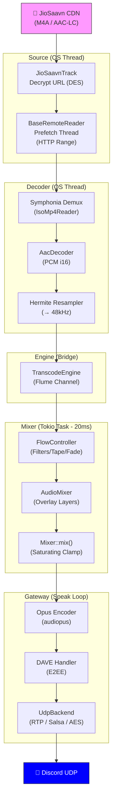

# Audio Flow: JioSaavn (M4A/AAC) → Discord UDP

> Source: JioSaavn CDN — `.mp4` container / **AAC-LC** codec  
> Output: encrypted Opus RTP over Discord UDP  
> Frame size: **1920 i16 samples** (960 stereo @ 48 kHz = **20 ms**)

---

## Visual Flowchart (ASCII)

```
  ┌────────────────────────────────────────────────────────────────────┐
  │                      DISCORD CLIENT REQUEST                        │
  │               POST /v4/sessions/{sid}/players/{guild}              │
  └───────────────────────────────┬────────────────────────────────────┘
                                  │
                                  ▼
  ┌────────────────────────────────────────────────────────────────────┐
  │  STAGE 0 — API Layer                                               │
  │  src/player/playback.rs · start_playback()                         │
  │                                                                    │
  │  SourceManager::get_track(&track_info)                             │
  │         └──► JioSaavnSource::get_track()                           │
  │                  src/sources/jiosaavn/mod.rs :178                  │
  └───────────────────────────────┬────────────────────────────────────┘
                                  │  Box<dyn PlayableTrack>
                                  ▼
  ┌────────────────────────────────────────────────────────────────────┐
  │  STAGE 1 — URL Decrypt                                             │
  │  src/sources/jiosaavn/track.rs · JioSaavnTrack::start_decoding()  │
  │                                                                    │
  │  encrypted_media_url (Base64)                                      │
  │         │                                                          │
  │         ├─ BASE64_STANDARD.decode()                                │
  │         ├─ DES::new_from_slice(&secret_key)  (8-byte key)          │
  │         ├─ cipher.decrypt_block() × N chunks                       │
  │         └─ PKCS5 unpad ──► "https://…cdn…_320.mp4"                │
  │                                                                    │
  │  Spawns  ◄── std::thread::spawn()  (OS thread)                     │
  │  Channels created:                                                 │
  │    pcm_tx ──────────── flume::bounded::<Vec<i16>>(4)               │
  │    cmd_tx ──────────── flume::unbounded::<DecoderCommand>()        │
  │    err_tx ──────────── flume::bounded::<String>(1)                 │
  └───────────────────────────────┬────────────────────────────────────┘
                                  │  decrypted CDN url
                                  │  [OS Thread]
                                  ▼
  ┌────────────────────────────────────────────────────────────────────┐
  │  STAGE 2 — HTTP Prefetch                                           │
  │  src/sources/jiosaavn/reader.rs · JioSaavnReader::new()            │
  │  src/audio/remote_reader/mod.rs · BaseRemoteReader::new()          │
  │                                                                    │
  │  create_client(USER_AGENT, local_addr, proxy)                      │
  │         └──► reqwest::Client  (15s timeout)                        │
  │                                                                    │
  │  BaseRemoteReader::fetch_stream(url, 0, None)  [block_on]          │
  │         └──► GET url  ·  Range: bytes=0-                           │
  │                                                                    │
  │  Spawns  ◄── thread "remote-prefetch"  (OS thread)                 │
  │    prefetch_loop()  [mod.rs :162]                                  │
  │         ┌─ GET Range:bytes=N-{N+5MB}                               │
  │         ├─ res.chunk().await  →  state.next_buf.extend()           │
  │         └─ cvar.notify_all()  (buffers up to 8 MB ahead)           │
  │                                                                    │
  │  BaseRemoteReader: Read + Seek + MediaSource                       │
  │    read() ──► serve from buf, or wait on Condvar + swap Vec        │
  └───────────────────────────────┬────────────────────────────────────┘
                                  │  impl MediaSource
                                  ▼
  ┌────────────────────────────────────────────────────────────────────┐
  │  STAGE 3 — Demux                                                   │
  │  src/audio/demux/mod.rs · open_format(source, AudioKind::Mp4)      │
  │                                                                    │
  │  MediaSourceStream::new(source)                                    │
  │  Hint::new().with_extension("mp4")                                 │
  │  symphonia::default::get_probe().format(hint, mss, …)              │
  │         └──► IsoMp4Reader  (M4A/MP4 demuxer)                       │
  │                                                                    │
  │  tracks().find(codec ≠ NULL)  →  CODEC_TYPE_AAC                    │
  │  get_codecs().make(&codec_params)                                  │
  │         └──► Box<dyn Decoder> = AacDecoder  (AAC-LC/HE-AAC)        │
  │                                                                    │
  │  Returns: DemuxResult::Transcode {                                 │
  │      format, track_id, decoder,                                    │
  │      sample_rate: u32,  channels: 2                                │
  │  }                                                                 │
  └───────────────────────────────┬────────────────────────────────────┘
                                  │  DemuxResult::Transcode
                                  ▼
  ┌────────────────────────────────────────────────────────────────────┐
  │  STAGE 4 — AudioProcessor  (OS thread — decode loop)               │
  │  src/audio/processor.rs · AudioProcessor::new() + run()            │
  │                                                                    │
  │  ┌─ AudioProcessor::new() ─────────────────────────────────────┐  │
  │  │  source_rate = e.g. 44100 (from codec params)               │  │
  │  │  target_rate = 48_000                                        │  │
  │  │  engine = Box<TranscodeEngine::new(pcm_tx)>                  │  │
  │  └─────────────────────────────────────────────────────────────┘  │
  │                                                                    │
  │  AudioProcessor::run()  ──  LOOP:                                  │
  │    1. check_commands()  ──► cmd_rx.try_recv()                      │
  │         Seek(ms) → format.seek() + resampler.reset()              │
  │         Stop     → break                                           │
  │    2. format.next_packet()  ──► IsoMp4Reader reads AAC packet      │
  │    3. decoder.decode(&packet)  ──► AudioBufferRef<f32>             │
  │    4. SampleBuffer<i16>::copy_interleaved_ref()                    │
  │         └──► interleaved stereo i16 samples                        │
  └───────────────────────────────┬────────────────────────────────────┘
                                  │  &[i16]  (raw decoded samples)
                                  ▼
  ┌────────────────────────────────────────────────────────────────────┐
  │  STAGE 5 — Resampler                                               │
  │  src/audio/resample/hermite.rs · HermiteResampler::process()       │
  │                                                                    │
  │  if source_rate ≠ 48000:                                           │
  │    Resampler::hermite(src_rate, 48000, 2)                          │
  │         └──► Catmull-Rom cubic spline upsampling                   │
  │              4-point history per channel                           │
  │              output samples ≈ n × (48000 / src_rate)              │
  │                                                                    │
  │  if source_rate == 48000:                                          │
  │    Resampler::linear()  →  identity (samples copied as-is)         │
  │                                                                    │
  │  Output: Vec<i16>  @ 48 000 Hz stereo                              │
  └───────────────────────────────┬────────────────────────────────────┘
                                  │  Vec<i16>  @ 48 kHz
                                  ▼
  ┌────────────────────────────────────────────────────────────────────┐
  │  STAGE 6 — TranscodeEngine  (channel bridge)                       │
  │  src/audio/engine/transcode.rs · TranscodeEngine::push_pcm()       │
  │                                                                    │
  │  pcm_tx.send(pooled_vec)                                           │
  │         └──► flume::bounded(4)  ◄── back-pressure                  │
  │              blocks decode thread if Mixer is slow                 │
  └───────────────────────────────┬────────────────────────────────────┘
                                  │  flume channel  Vec<i16>
                      ════════════╪════════════
                       OS thread  ╳  Tokio task  (boundary)
                      ════════════╪════════════
                                  │
                                  ▼
  ┌────────────────────────────────────────────────────────────────────┐
  │  STAGE 7 — FlowController  (inline inside Mixer tick)              │
  │  src/audio/flow/controller.rs · FlowController::try_pop_frame()    │
  │                                                                    │
  │  pcm_rx.try_recv()  →  pending_pcm.extend(chunk)                  │
  │  while pending_pcm.len() < FRAME_SIZE_SAMPLES (1920): drain more   │
  │                                                                    │
  │  once 1920 samples ready:                                          │
  │  FlowController::process_frame(&mut frame)  [controller.rs :146]  │
  │    ├─ A. FilterChain::process(frame)    ← EQ / reverb             │
  │    ├─ B. TapeEffect::process(frame)     ← pitch/speed ramp        │
  │    ├─ C. VolumeEffect::process(frame)   ← gain + soft limiter     │
  │    ├─ D. FadeEffect::process(frame)     ← fade in/out             │
  │    └─ E. CrossfadeController::process() ← blend next track        │
  │                                                                    │
  │  Returns: Ok(Some(frame))  — 1920 × i16                           │
  └───────────────────────────────┬────────────────────────────────────┘
                                  │  [i16; 1920] processed frame
                                  ▼
  ┌────────────────────────────────────────────────────────────────────┐
  │  STAGE 8 — Mixer  (every 20ms, async Tokio task)                   │
  │  src/audio/mix/mixer.rs · Mixer::mix(&mut [i16; 1920])             │
  │                                                                    │
  │  for each MixerTrack:                                              │
  │    pull frames from FlowController::try_pop_frame()                │
  │    accumulate into mix_buf[j] += sample as i32                     │
  │  clamp i32 → i16 range                                             │
  │                                                                    │
  │  AudioMixer::mix(&mut final_pcm)                                   │
  │    └──► overlay named sound-effect layers (up to 5)                │
  │                                                                    │
  │  buf.copy_from_slice(&final_pcm)                                   │
  │         └──► pcm_buf [i16; 1920] = 20ms stereo PCM @ 48kHz        │
  └───────────────────────────────┬────────────────────────────────────┘
                                  │  [i16; 1920]
                                  ▼
  ┌────────────────────────────────────────────────────────────────────┐
  │  STAGE 9 — Global Filters (optional)                               │
  │  src/gateway/session.rs :911 · FilterChain::process()              │
  │                                                                    │
  │  if filter_chain.is_active():                                      │
  │    fc.process(&mut pcm_buf)   ← global EQ / timescale             │
  │    if fc.has_timescale():                                          │
  │      fc.fill_frame(&mut ts_frame_buf)  →  encode ts_frame instead  │
  └───────────────────────────────┬────────────────────────────────────┘
                                  │  [i16; 1920]
                                  ▼
  ┌────────────────────────────────────────────────────────────────────┐
  │  STAGE 10 — Opus Encoder                                           │
  │  src/audio/engine/encoder.rs · Encoder::encode()                   │
  │                                                                    │
  │  audiopus::OpusEncoder {                                           │
  │    sample_rate: Hz48000,                                           │
  │    channels:   Stereo,                                             │
  │    application: Audio   ← music-optimised                          │
  │    bitrate:    Auto                                                │
  │  }                                                                 │
  │                                                                    │
  │  encoder.encode(&[i16; 1920], &mut [u8; 4000])                       │
│         └──► size: usize  (Opus packet)                              │
└───────────────────────────────┬──────────────────────────────────────┘
                                │  Opus packet
                                ▼
┌──────────────────────────────────────────────────────────────────────┐
│  STAGE 11 — DAVE Encryption  (E2EE - optional)                      │
│  src/gateway/session.rs :951 · DaveHandler::encrypt_opus()          │
│                                                                   │
│  if DAVE active (DM/Group):                                       │
│    MLS-derived key → AES-128-GCM encrypt                          │
│  else:                                                            │
│    identity pass (standard server voice)                          │
└───────────────────────────────┬───────────────────────────────────┘
                                │  encrypted / raw Opus
                                ▼
┌───────────────────────────────────────────────────────────────────┐
│  STAGE 12 — UdpBackend  (RTP + Transport Encryption)              │
│  src/gateway/udp_link.rs :64 · send_opus_packet()                 │
│                                                                   │
│  1. Build 12-byte RTP Header:                                     │
│     [Version 0x80 | Type 0x78 | Seq | Timestamp | SSRC]           │
│                                                                   │
│  2. Choose Encryption Mode:                                       │
│     ├─ XSalsa20Poly1305 (legacy)                                  │
│     │    nonce[0..12] = header                                    │
│     │    encrypt_in_place(header, payload)                        │
│     │                                                             │
│     └─ Aes256Gcm (modern)                                         │
│          nonce[0..4] = counter                                    │
│          encrypt_in_place(header, payload)                        │
│                                                                   │
│  3. Packet Structure:                                             │
│     [ RTP Header | Ciphertext | Auth Tag | (Optional Nonce) ]     │
└───────────────────────────────┬───────────────────────────────────┘
                                │  UDP Datagram
                                ▼
┌───────────────────────────────────────────────────────────────────┐
│                    📡 DISCORD VOICE GATEWAY                       │
│                         UDP port 5000x                            │
└───────────────────────────────────────────────────────────────────┘
```

---

## Mermaid Visual Diagram



---

## Technical Summary

| Parameter | Value |
|---|---|
| **Input Format** | M4A (MPEG-4 Part 14) |
| **Input Codec** | AAC-LC (Advanced Audio Coding) |
| **Internal PCM** | 48 000 Hz, 16-bit, Stereo (Interleaved) |
| **Processing Tick** | 20 ms (960 samples/channel) |
| **Output Codec** | Opus (Application: Audio) |
| **Transport** | RTP over UDP |
| **Encryption** | XSalsa20-Poly1305 or AES-256-GCM |

### Important Files
- [jiosaavn/track.rs](file:///home/sayan/Coding/Rustalink/src/sources/jiosaavn/track.rs) — Decryption & Thread start
- [audio/processor.rs](file:///home/sayan/Coding/Rustalink/src/audio/processor.rs) — Decoder loop
- [audio/flow/controller.rs](file:///home/sayan/Coding/Rustalink/src/audio/flow/controller.rs) — Effects chain
- [gateway/session.rs](file:///home/sayan/Coding/Rustalink/src/gateway/session.rs) — 20ms Speak loop
- [gateway/udp_link.rs](file:///home/sayan/Coding/Rustalink/src/gateway/udp_link.rs) — UDP packet assembly

